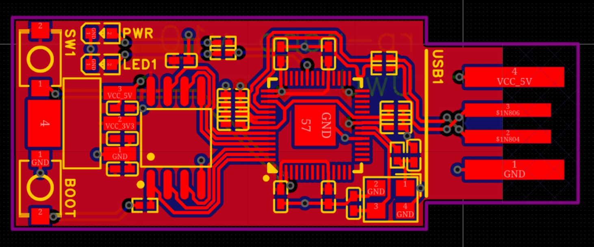
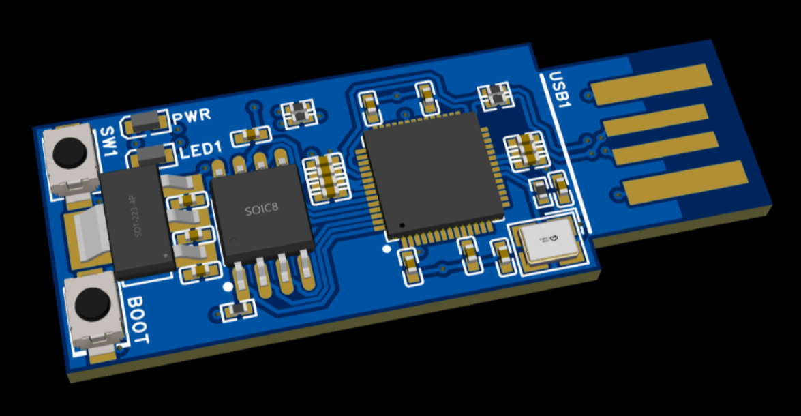
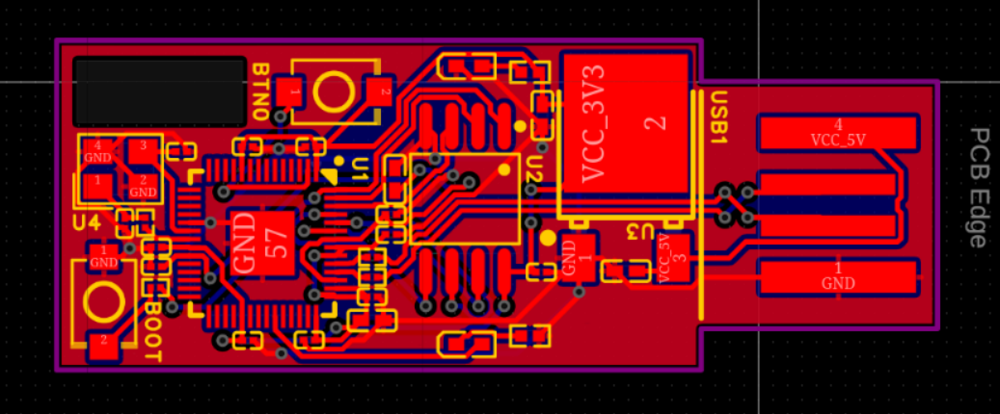
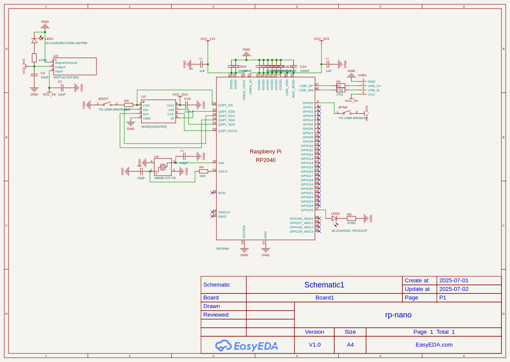

title: "rp-nano"
author: "TheTridentGuy"
description: "Minimal RP2040 board, designed for USB HID applications."
## Total time: 16h

### August 19:
1h 

PCBs finally arrived today, but I was saddened to discover that the "same LDO in correct package" was actually "different LDO in the correct package" (fuck whoever thought having the same part numbers for different voltages of LDO was a good idea). So the 3V3 line was actually a 1V25 line. Never fear though! I put it on 3V3 life support and its working! Updates coming soon!

### July 24:
8h

I spent a bit of yesterday and most of today redoing my layout and all my traces, and I also made some other major changes based on suggestions from people in the slack.
I also switched to a 4 layer PCB, as it allowed for much cleaner routing. Heres my latest, and very close to final version:

### July 8:
1h

Due to my failure to base my project off of basic parts, and use of the wrong LDO and I'm going to redo my layout, and most of my routing.

### July 2:

8h

I got really carried today and spent basically the entire day working on this, and I've completed the entire schematic, and most of the PCB. I chose
to do the PCB routing by hand, which took more time, but allowed me to keep in mind which connections needed to be optimized.

