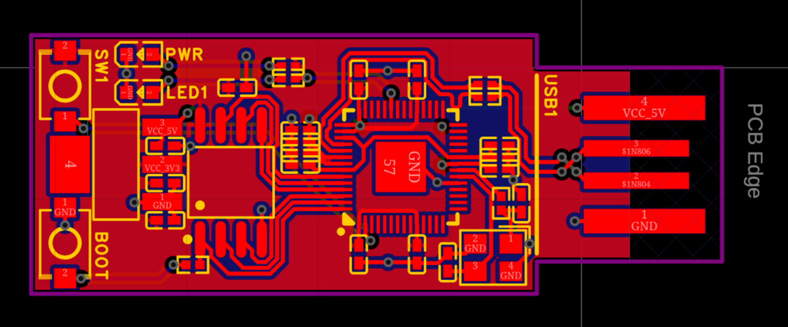
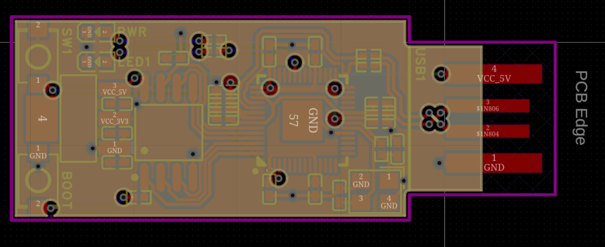
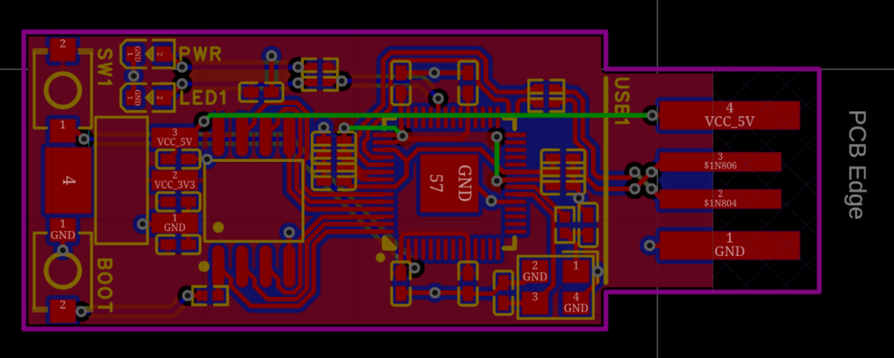
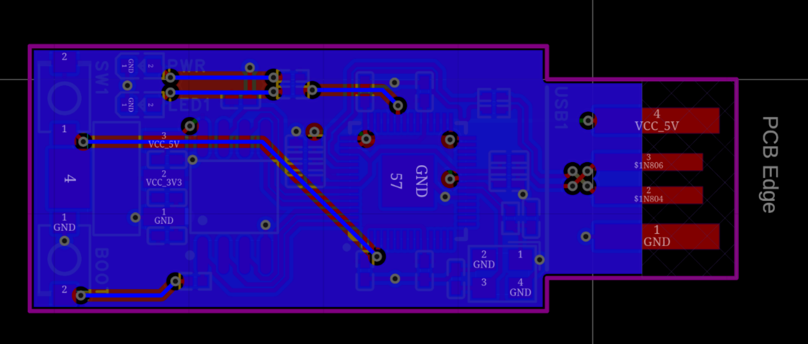
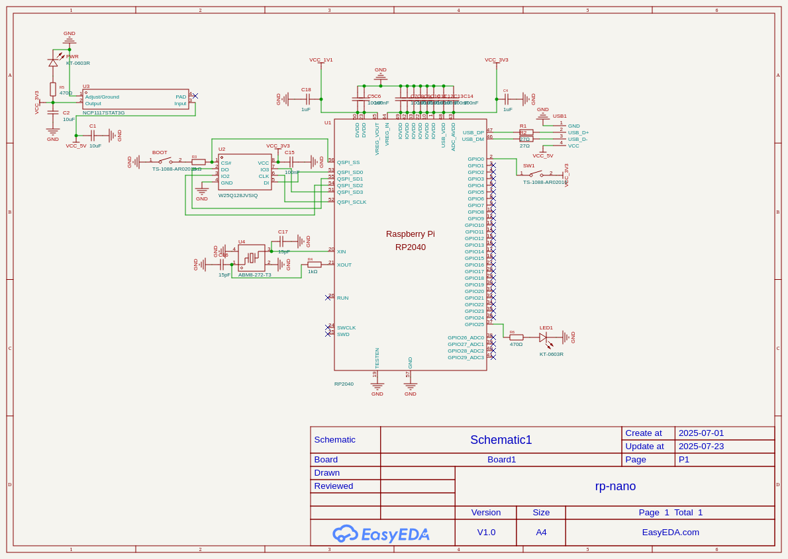

# rp-nano
## Tiny RP2040 based board, ideal for USB HID applications, i.e USB rubber ducky.

I designed this mainly for rubber ducky applications. It's extremely similar to the [picoducky](https://github.com/Outdatedcandy92/PicoDucky), but rp2040 based, and I started designing it before i knew picoducky was a thing.

### PCB:

### Schematic:

### BOM:

| Item     | Qty | Price Each | Running Total |
|-         |-    |-           |-              |
| PCBs x10 | 1   | $139       | $139          |
